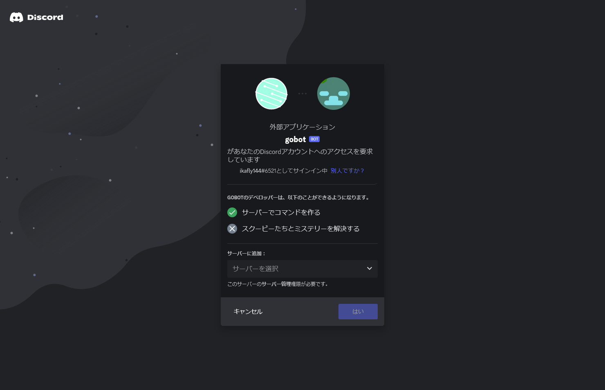
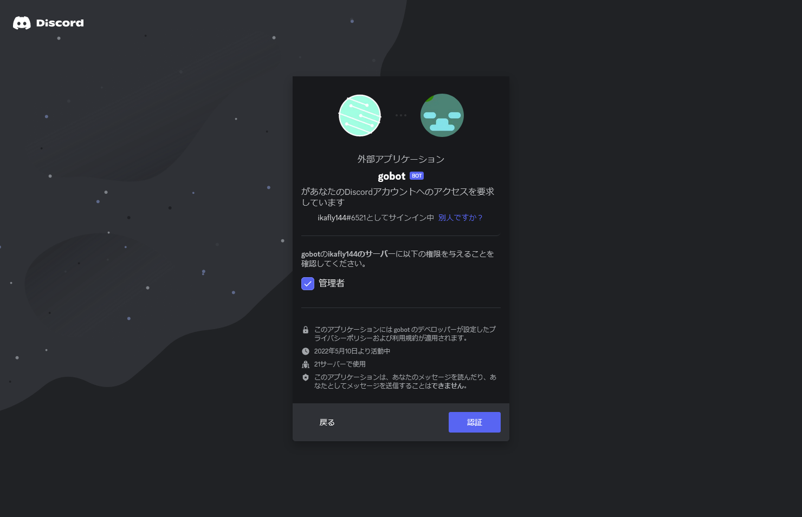
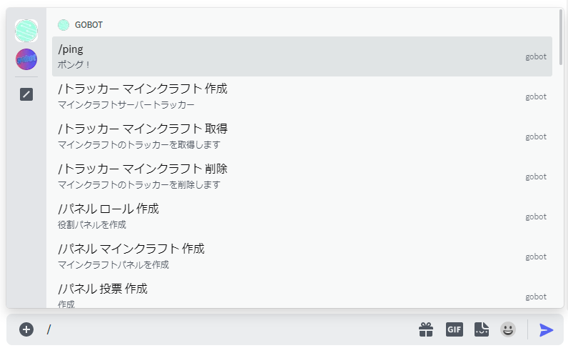
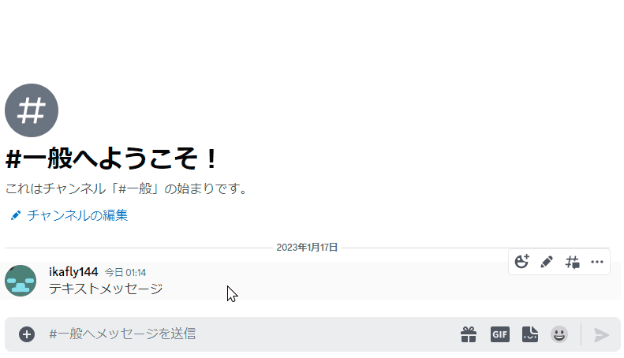
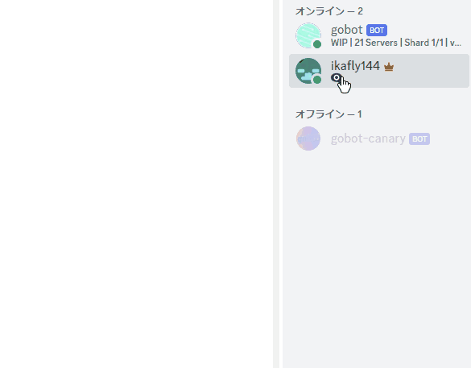

export const Warn = ({children}) => (
  
    {children}
  
);

このボットを利用するには前提としてボットがサーバーに導入されている必要があります。

## 導入

サーバーにはこの
[招待リンク](https://discord.com/api/oauth2/authorize?client_id=973391124389572608&permissions=8&scope=bot%20applications.commands)
でボットを招待することができます。

### 招待ページ

### 権限を与える

- **ボットは管理者権限がないと<Warn>正しく動作しません</Warn>。**

## 操作方法

基本アプリケーションコマンドを用いて操作します。
アプリケーションコマンドにアクセスするには三つの方法があります。

- スラッシュコマンド
- メッセージコマンド
- ユーザーコマンド

#### スラッシュコマンド

テキストチャンネルで `/`(スラッシュ) を入力して利用することができます。

#### メッセージコマンド

任意のメッセージを右クリックか長押ししてメニューを開き、アプリから利用することができます。

#### ユーザーコマンド

任意のユーザーを右クリックか長押ししてメニューを開き、アプリから利用することができます。

