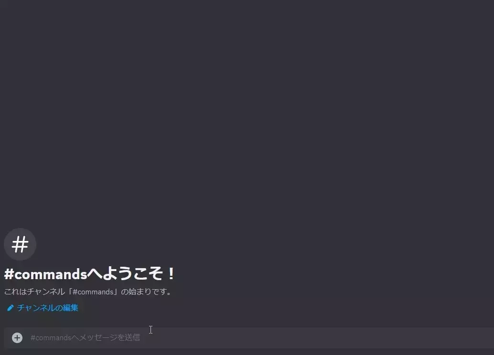
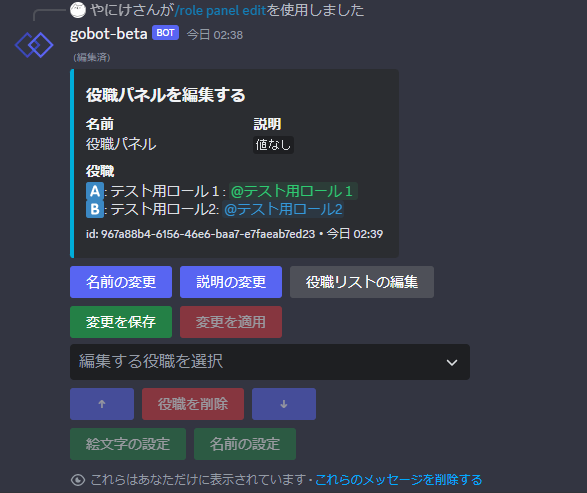

役職パネルを使用することでギルドメンバーが自身のロールを簡単に取得、削除することができます。

---
## 使い方
基本的な役職パネルの使用方法を解説します。
### 役職パネルを登録する
まずは `create` コマンドで新たな役職パネルを作成しましょう。

`create` コマンドを実行すると画像のようなフォームが表示されます。このフォームに役職パネルの名前と説明を入力します。(役職パネルの名前と説明は後からいつでも変更できます)

フォームを送信すると役職パネルが作成され、ギルドに登録されます。

登録された役職パネルは同じギルドなら何度でも再利用することができます。

画像のような編集パネルが作成されます。このパネルを使って、ロールを追加・削除したり、パネルの名前を変更したり、役職に絵文字を設定したりすることができます。

編集パネルの操作方法は [役職パネルを編集する](#役職パネルを編集する) セクションを参照してください。

:::note 追記
この編集パネルはあなた専用のパネルなので他人の目を気にすることなく役職パネルを編集することができます。
:::
---
### 役職パネルを設置する
役職パネルは `place` コマンドで設置できます。実行したチャンネルにパネルが作成されます。登録した役職パネルは設置することでメンバーが利用できるようになります。

`place` コマンドを実行すると設定パネルが作成されます。設定パネルでは設置する役職パネルの種類やカスタム設定を変更することができます。

パネルの設定が完了したら、配置ボタンを押すことで役職パネルを設置することができます。

:::tip
登録したパネルは何回でも配置することができます。
:::

#### 役職パネルの種類と設定
設置する役職パネルには以下のような種類があります。

**パネルの種類**
1. リアクションパネル
2. セレクトメニューパネル
3. ボタンパネル
##### リアクションパネル

リアクションパネルはDiscordのリアクション機能を使って役職を操作するパネルです。パネルについているリアクションを押すことで役職を追加・削除することができます
##### セレクトメニューパネル

セレクトメニューパネルはセレクトメニューから追加したい役職をすべて選ぶことで役職を追加するパネルです。セレクトメニューで選ばれなかった役職は解除されます。一度に多くの役職をまとめて取得・解除することができます。

**カスタム設定**
- **折り畳みメニューを使用する：**デフォルト <オフ>
	オンにすることで折り畳みメニューを使用します。
	折り畳みメニューを使うことで今自分が持っている役職が分かりやすくなります。
##### ボタンパネル

ボタンパネルは対応した役職のボタンを押すことで役職を操作するパネルです。パネルについているボタンを押すことで役職を追加・削除できます。

**カスタム設定**
- **ボタンの色：**デフォルト <グリーン> 
	ボタンの色を四つの種類の中から選べます。

- **ボタンに名前を表示する：**デフォルト <オフ> 
	ボタンの絵文字の横に役職の表示名を表示します。

---
### 役職パネルを編集する
`edit` コマンドで登録した役職パネルを編集することができます。登録した役職パネルはいつでも `edit` コマンドで編集することができます。また、編集した内容は==即座にすべての配置された役職パネルに適用されます==。

同じ役職パネルを同時に編集することはできません。
#### 編集パネルの操作方法

`edit` コマンドを実行すると画像のような編集パネルが作成されます。このパネルを使って役職パネルをカスタマイズすることができます。
##### 名前の変更
「名前の変更」ボタンを押すと名前変更フォーラムが開きます。入力欄には最大32文字まで任意の名前を入力することができます。
##### 説明の変更
「説明の変更」ボタンを押すと説明変更フォーラムが開きます。入力欄には最大140字まで任意の説明を入力することができます。入力欄は省略可能です。入力を省略した場合、パネルには説明が設定されません。
##### 役職リストの編集
「役職リストの編集」ボタンを押すとロール選択画面に移行します。ロールセレクトメニューから追加したいロールを選ぶことで役職リストに追加することができます。

選択されたロールが利用不可能な場合役職リストに追加することができません。ロールの順位等を確認してから試してみてください。(例：ロールがボットのロールより上位にある等)
##### 役職選択メニュー
編集パネルには役職セレクトメニューがあります。役職セレクトメニューで選択されている役職を下の列のボタンで編集することができます。

##### 絵文字の設定
「絵文字の設定」ボタンを押すと絵文字受付画面に移行します。絵文字受付画面の最中にそのチャンネルに絵文字を送信することで絵文字を選択されている役職に設定できます。絵文字が正しく設定された場合、「✅」のリアクションが付与されます。

##### 表示名の設定
「表示名の設定」ボタンを押すと役職の表示名設定フォームに移行します。入力欄には最大32文字まで任意の表示名を入力することができます。

設定された表示名はセレクトメニューパネルやボタンパネルで使用されます。

##### リストから削除
「リストから削除」ボタンを押すと選択されている役職が役職パネルから削除されます。

---
### 役職パネルを削除する
`delete` コマンドで登録した役職パネルを削除することができます。

:::caution
役職パネルが削除された場合、設置していた役職パネルメッセージはすべて削除され、利用できなくなります。
**削除は二度と元に戻すことができないので注意して行ってください。**
:::

---
## コマンド
**一覧**
- `/role panel-v2`
	- `create` *役職パネルを作成して登録*
	- `place` *登録されている役職パネルを設置*
	- `edit` *登録されている役職パネルを編集*
	- `delete` *登録されている役職パネルを削除して登録解除*
### create コマンド
**引数**
- `なし`

新たな役職パネルを作成して一覧に登録します。
### place コマンド
**引数**
- `panel: <文字列>` 設置するパネルの名前もしくはuuid

一覧に登録されている役職パネルから選んだパネルを実行したチャンネルに設置します。
### edit コマンド
**引数**
- `pabel: <文字列>` 編集するパネルの名前もしくはuuid

一覧に登録されている役職パネルから選んだパネルを編集します。
同時に同じ役職パネルを編集することはできません。
### delete コマンド
**引数**
- `panel: <文字列>` 編集するパネルの名前もしくはuuid

一覧に登録されている役職パネルから選んだパネルを編集します。
同時に同じ役職パネルを編集することはできません。
